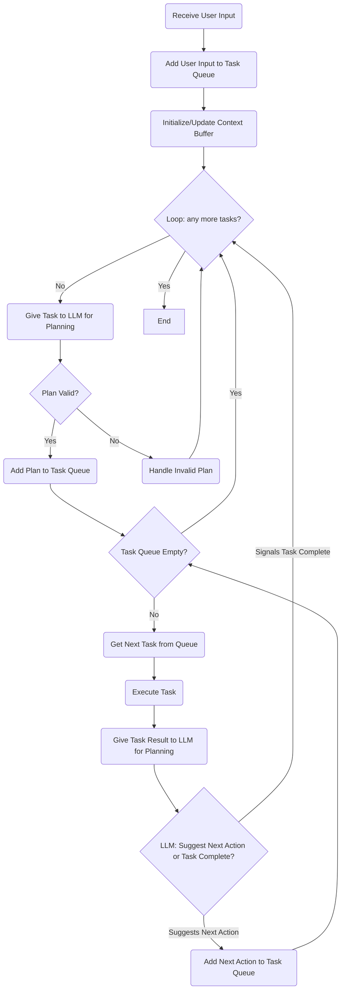

⚠️ This document is generated automatically using an LLM to summarize changes to the codebase ⚠️

# Flipper Zero AI Agent Architecture

This document describes the architecture and technical details of the Flipper Zero AI Agent.

## Core Components

### 1. PyFlipper Integration
- Direct communication with Flipper Zero via serial connection
- Command sending and response parsing
- Device state management

### 2. LLM Integration
- Connection to LiteLLM API (currently configured for Ollama)
- Prompt engineering and response parsing
- Context management and history tracking

### 3. RAG System
- Vector database of Flipper Zero CLI documentation
- Semantic search for relevant commands
- Context enhancement for more accurate command generation

## Special Markers System


## Tool Call System

The agent uses a structured tool call system for communication between components:

### 1. Tool Definitions
The agent defines four tools for the LLM to use:
- `execute_commands`: For sending commands to the Flipper Zero device
- `provide_information`: For displaying information to the user
- `ask_question`: For asking the user for clarification
- `mark_task_complete`: To indicate the task is finished

### 2. Tool Call Format
The LLM returns a JSON array of tool calls. Each tool call has a `name` and `arguments` object.

Example:
```json
[
  {
    "name": "execute_commands",
    "arguments": {
      "commands": ["led g 255", "led bl 255"]
    }
  },
  {
    "name": "mark_task_complete",
    "arguments": {}
  }
]
```

### 3. Tool Processing
The agent processes each tool call in order:
- `execute_commands`: Sends the commands to the Flipper Zero and displays the responses
- `provide_information`: Displays the information to the user
- `ask_question`: Asks the user a question and pauses execution
- `mark_task_complete`: Marks the task as complete and returns control to the user

### 4. Critical Rule: Task Completion
After executing commands, the LLM MUST include `mark_task_complete` to prevent infinite loops. The agent enforces this by automatically adding `mark_task_complete` if it's missing after command execution.

## Token-Efficient Context Management
The agent uses advanced techniques to manage the token context window efficiently:

### Progressive Summarization
- Command sequences are summarized to preserve context while using fewer tokens
- Summaries replace verbose exchanges in the conversation history
- This enables longer conversations while staying within token limits

### Smart History Pruning
- Token count is estimated and tracked for all history entries
- When token limit is reached, oldest entries are pruned
- Pruning preserves essential context when possible

### History Compression
When a summary is provided:
1. Original commands are preserved for execution
2. Detailed explanations are replaced by the summary
3. Token usage is significantly reduced
4. Essential context is maintained for future interactions

## Task Tracking System

The agent maintains state about ongoing tasks:

### Task Lifecycle
1. Task initiated by user prompt
2. Tool calls generated by LLM
3. Tool calls processed in order
4. If task not completed, agent recursively continues processing
5. Process repeats until task completion or max recursion depth

### Recursion Handling
- Each tool call processing step increases recursion depth
- Maximum recursion depth is configurable (default: 10)
- When max depth reached, task is forced to complete
- Prevents infinite loops from malformed LLM responses

### Error Handling
- Command execution errors are captured
- Errors are fed back to the LLM for analysis
- Recovery strategies can be generated
- Critical errors force task completion

## Logging System


Comprehensive logging captures all aspects of agent operation:

- Command execution and responses (flipper_agent_with_rag.py lines 179-203)
- LLM interactions (LLMAgent class)
- Context management decisions (estimate_tokens and _prune_history_by_tokens)
- Errors and exceptions (try/except blocks throughout)

Logs are timestamped and stored in the `logs` directory (configured in flipper_agent_with_rag.py lines 21-23) using rotating file handlers.

## Build & Execution

The system uses two key shell scripts:

### setup.sh
- Creates Python virtual environment
- Installs dependencies from requirements.txt
- Initializes PyFlipper submodule
- Sets executable permissions

### run.sh
- Handles command-line arguments
- Manages documentation vector store
- Configures LLM parameters
- Launches main agent with proper environment

## Dependencies

- PyFlipper (submodule for hardware communication)
- LangChain (RAG pipeline)
- FAISS (vector store)
- HuggingFace Embeddings (text embeddings)
- LiteLLM (LLM API abstraction)
## TODO

### AgentFlipper Loop Pattern

