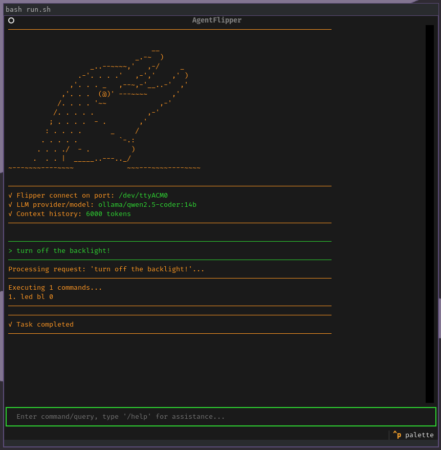

# AgentFlipper

A Python solution that connects your Flipper Zero any LLM service including local Ollama, allowing you to control your Flipper Zero using natural language commands with context-aware conversations.

⚠️ This project is under very active development, experimentation, and rapid-prototyping ⚠️

## Overview

- Controls Flipper Zero over serial via PyFlipper
- Uses LiteLLM as the backend to allow you to use any LLM endpoint
- Uses Retrieval-Augmented Generation (RAG) make sure the LLM is aware of Flipper documentation
- Uses LangChain for tool/function calling
- Maintains conversation context for natural follow-up commands
- Intelligently executes multi-step tasks
- Comprehensive logging for debugging



For technical details, see [ARCHITECTURE.md](./ARCHITECTURE.md).

## Requirements

- Python 3.9+ and pip dependencies listed in requirements.txt
- Flipper Zero device
- Ollama or an LLM provider

## Installation

Clone this repository with submodules:

```bash
git clone --recursive https://github.com/yourusername/flipper-agent
cd flipper-agent
```

### Using Setup Script

```bash
./setup.sh
```

### Manual Method

1. Install required Python packages:

```bash
pip install -r requirements.txt
```

2. Pull the recommended Qwen model in Ollama:

```bash
ollama pull qwen2.5-coder:14b
```

4. Fill out config.yaml.example and rename to config.yaml

## Usage

1. If you don't use the run.sh script, you will need to build the documentation database (only needed once):

```bash
./docs_loader.py
```

2. And then you can run the agent:

```bash
./main.py
```

3. Enter your commands in natural language:
   - "Show device information and status"
   - "Turn on the green LED and set backlight to 50%"
   - "Scan for NFC tags and save any found ones"
   - "Help me clone this NFC tag to file 'mycard'"
   - "Analyze the last SubGHz scan results"

## Command-line Options

The agent supports these options:

- `--port PORT`: Specify the serial port (default: /dev/ttyACM0)
- `--config FILE`: Use a custom config file
- `--model MODEL`: Use a specific model (e.g., "ollama/qwen2.5-coder:14b")
- `--no-rag`: Disable RAG retrieval system
- `--max-history-tokens TOKENS`: Set maximum token count for conversation history
- `--console-log`: Show log messages in console (default: log to file only)
- `--console-log`: Show log messages in console (default: log to file only)
- `--log-level {DEBUG,INFO,WARNING,ERROR,CRITICAL}`: Set logging verbosity

## Configuration

The config file is loaded from:
1. `~/.config/flipper_agent/config.yaml` (if exists)
2. `./config.yaml` (project directory)

## TODO
- rename execute_commands to serial_commands
- Task queue with evaluation loop
- Validate planning prompts
- Re-add divider lines between tasks/subtasks
- No freeze in textual
- Analyze data that is not serial commands
- Fix token issue
- Smarter context management needed
- Automated testing needed
- Cannot copy/paste into terminal
- Get the theming right
- RAG more documentation and hacking tutorials
- Window resizing is broken
- Clean up obsolete code and redundant comments
- Test that planning LLM is capable of inserting tasks *in between* other tasks
- Ask 8K AI to validate tasks
- Change output to have standard terms, like requests, tasks, plans, actions, etc.
- Provide live view of task list in sidebar like treemacs
- Add proper human-in-the-middle
- Make tool calling extensible via plugins
- change execute_commands tool to pyflipper

## Licensing

GNU General Public License v3.0 (GPLv3)