⚠️ This document is generated automatically using an LLM to summarize changes to the codebase ⚠️

# Flipper Zero AI Agent Architecture

This document describes the architecture and technical details of AgentFlipper.

## Core Components

This section details the main software components that constitute AgentFlipper.

### 1. AgentLoop (`agent_loop.py`)
- Implements the main Plan, Act, Reflect processing loop.
- Manages the overall workflow and interaction between other components.
- Handles state checks (task queue, human input) to control loop execution.

### 2. AgentState (`agent_loop/agent_state.py`)
- Centralized repository for the agent's state.
- Includes conversation history, context buffer, task queue, current task, and flags for human interaction.
- Provides methods for updating state and clearing for new sessions.

### 3. TaskManager (`agent_loop/task_manager.py`)
- Manages the queue of tasks (actions) for the agent to execute.
- Responsible for adding user tasks, adding planned actions from the LLM, and retrieving the next task.
- Provides a simple check for whether the queue is empty.

### 4. ToolExecutor (`agent_loop/tool_executor.py`)
- Executes individual tasks/actions by mapping tool names to specific functions.
- Handles execution of Flipper Zero commands (`pyflipper`), providing information, and signaling for human interaction (`ask_human`).
- Manages error handling during tool execution.

### 5. UnifiedLLMAgent (`llm/llm_agent.py`)
- Handles all interactions with the Large Language Model (LLM).
- Responsible for creating initial plans based on user input and reflecting on task results to determine next steps.
- Uses LiteLLM for API abstraction and manages prompt formatting and response parsing.

### 6. Prompts (`llm/prompts.py`)
- Centralized management of all prompts used for interacting with the LLM.
- Defines the system prompt and templates for planning, reflection, and human input processing.

### 7. HumanInteractionHandler (`ui/human_interaction.py`)
- Manages specific human-in-the-loop interaction flows.
- Includes handling requests for clarification, plan approval, and error resolution by updating AgentState and signaling the UI.

### 8. PyFlipper Integration
- Direct communication with Flipper Zero via serial connection (details managed by a separate integration layer, likely utilized by ToolExecutor).
- Command sending and response parsing.
- Device state management.

### 9. LLM Integration
- Connection to LiteLLM API (currently configured for Ollama).
- Prompt engineering and response parsing (handled by UnifiedLLMAgent and Prompts).
- Context management and history tracking (handled by AgentState and potentially UnifiedLLMAgent).

### 10. RAG System
- Vector database of Flipper Zero CLI documentation.
- Semantic search for relevant commands.
- Context enhancement for more accurate command generation.

## Special Markers System

## Function/Tool Calling

The agent uses a structured tool call system for communication between components:

### 1. Tool Definitions
The agent defines the following tools that the LLM can call:
- `pyflipper`: For sending commands to the Flipper Zero device.
- `provide_information`: For displaying information to the user via the UI.
- `ask_human`: For asking the user for clarification or input.
- `mark_task_complete`: To indicate the overall task is finished.

### 2. Tool Call Format
The LLM is expected to return a JSON array of tool calls, or a structured JSON object for reflection actions. Each tool call follows a format like:
```json
{
  "action": "tool_name",
  "parameters": { ... }
}
```

Example of a plan (array of tool calls):
```json
[
  {
    "action": "pyflipper",
    "parameters": {
      "commands": ["led g 255", "led bl 255"]
    }
  },
  {
    "action": "mark_task_complete",
    "parameters": {}
  }
]
```

Example of a reflection action signalling completion:
```json
{
  "type": "task_complete"
}
```

### 3. Tool Processing
The `ToolExecutor` component processes valid tool calls requested by the LLM:
- `pyflipper`: Sends the specified commands to the Flipper Zero via the integrated PyFlipper layer and captures responses.
- `provide_information`: Displays the given text information to the user via the UI.
- `ask_human`: Signals to the `AgentLoop` and `HumanInteractionHandler` that human input is required, pausing execution of the main loop.
- `mark_task_complete`: Signaled by the LLM during reflection to indicate the overall task is complete. The `AgentLoop` interprets this to exit the main processing loop.

### 4. Critical Rule: Task Completion
The LLM is instructed to signal task completion using the `mark_task_complete` tool or a reflection action of type `task_complete` when the user's request is fully satisfied. The agent relies on this signal to terminate the processing loop for a given request.

## Task Tracking System

The agent maintains state about ongoing tasks using the `TaskManager` and manages the lifecycle via the `AgentLoop`.

### Task Lifecycle (Plan, Act, Reflect with Human-in-the-Loop)
1.  **Receive User Input:** A new request is received.
2.  **Initialize State/Context:** `AgentState` is cleared for a new session, and the context buffer is updated.
3.  **Plan:** If the task queue is empty, the `UnifiedLLMAgent` generates an initial plan (a sequence of actions/tool calls) based on the user request and current context.
4.  **Human Input (Planning):** If the LLM needs clarification to plan, it signals `awaiting_human_input`. The `AgentLoop` pauses, and the `HumanInteractionHandler` prompts the user. The loop resumes after input is processed by `AgentState` and potentially the `UnifiedLLMAgent`.
5.  **Plan Approval (Optional HITL):** If configured, the `HumanInteractionHandler` requests user approval for the plan. The `AgentLoop` pauses until approval is given via the UI and `AgentState`.
6.  **Add Plan to Queue:** The approved plan (or initial plan if approval is skipped) is added to the `TaskManager` queue.
7.  **Execute Task:** The `AgentLoop` retrieves the next task from the `TaskManager` queue. The `ToolExecutor` executes the corresponding tool.
8.  **Human Input (Execution/Tools):** If a tool requires human input (e.g., `ask_human` tool, or error resolution is enabled), the `AgentLoop` pauses via the `awaiting_human_input` flag, and the `HumanInteractionHandler` manages the interaction. The loop resumes after input.
9.  **Reflect:** The `AgentLoop` provides the task and its result to the `UnifiedLLMAgent` for reflection.
10. **Next Step Decision:** The LLM's reflection determines the next step:
    *   **Add More Tasks:** If more actions are needed, the LLM provides a list of new tasks, which are added to the `TaskManager` queue. The loop continues to step 7.
    *   **Task Complete:** If the overall goal is achieved, the LLM signals task completion. If human verification is configured, the `HumanInteractionHandler` prompts the user. Otherwise, the `AgentLoop` exits.
    *   **Human Input (Reflection):** If the LLM needs human input during reflection, it signals `awaiting_human_input`. The loop pauses, and the `HumanInteractionHandler` prompts the user. The loop resumes after input.
    *   **Provide Information:** If the LLM provides informational output, it's displayed, and the loop continues to check the queue.
11. **Loop Continuation:** The `AgentLoop` continues executing steps 7-10 as long as there are tasks in the queue or new tasks are generated by the LLM's reflection.
12. **Task Completion:** The loop exits when the LLM signals `task_complete` (and optional human verification passes) or if a maximum iteration limit is reached or an unrecoverable error occurs.

### Recursion Handling
- The `AgentLoop` includes a safety break (`max_loop_iterations`) to prevent infinite processing loops. This limits the number of Plan/Act/Reflect cycles for a single user request.

### Error Handling
- Errors during tool execution are caught by the `ToolExecutor` and returned as part of the task result.
- The `AgentLoop` passes task results, including errors, to the `UnifiedLLMAgent` for reflection, allowing the LLM to potentially suggest recovery strategies.
- Human-in-the-loop error resolution can be optionally enabled via the `HumanInteractionHandler`.
- Critical errors can force the `AgentLoop` to terminate.

## Human-in-the-Loop (HITL) Integration

AgentFlipper is designed with explicit human-in-the-loop integration points to allow user intervention and guidance. This is managed primarily by the `AgentLoop`, `AgentState`, and `HumanInteractionHandler`.

Key HITL Points:
-   **Planning Clarification:** When the LLM requires more information before creating a plan.
-   **Plan Approval:** Optional human review and approval of the generated plan before execution.
-   **Tool Execution Requests (`ask_human` tool):** When the LLM explicitly uses the `ask_human` tool to solicit input or a decision from the user.
-   **Error Resolution:** Optional human guidance when a task execution fails.
-   **Reflection Clarification:** When the LLM requires human input after reflecting on a task result to determine the next step.
-   **Final Verification:** Optional human confirmation that the overall task is completed as expected.

When human input is required, the `HumanInteractionHandler` updates `AgentState` to set the `awaiting_human_input` flag and provides details of the request. The `AgentLoop` detects this flag and pauses its execution. The UI is responsible for presenting the request to the user, capturing their input, and updating `AgentState` (clearing `awaiting_human_input`) to signal the `AgentLoop` to resume. The user's input is then typically processed by the `UnifiedLLMAgent` or directly affects the agent's state or task queue.

## Logging System

Comprehensive logging captures all aspects of agent operation:

- Command execution and responses (handled within `ToolExecutor` and the PyFlipper integration)
- LLM interactions (logged by `UnifiedLLMAgent`)
- State changes and context management decisions (handled within `AgentState` and `AgentLoop`)
- Errors and exceptions (caught and logged throughout the application)

Logs are timestamped and stored using Python's standard logging library, configured in `main.py` (not shown in snippet).

## Build & Execution

The system uses two key shell scripts for setup and execution.

### setup.sh
- Creates Python virtual environment
- Installs dependencies from requirements.txt
- Initializes PyFlipper submodule
- Sets executable permissions

### run.sh
- Handles command-line arguments
- Manages documentation vector store (for RAG)
- Configures LLM parameters
- Launches main agent with proper environment

## Dependencies

- PyFlipper (submodule for hardware communication)
- LangChain (RAG pipeline, potentially used for vector store/embeddings)
- FAISS (vector store implementation)
- HuggingFace Embeddings (text embedding models)
- LiteLLM (LLM API abstraction layer)
- Textual (for the command-line UI)

## TODO

### Diagrams

#### High-Level Flow

```mermaid
flowchart TD
    Start([User enters command]) --> Plan[🧠 PLAN<br/>LLM creates action list]
    Plan --> Act[⚡ ACT<br/>Execute actions]
    Act --> Reflect[🤔 REFLECT<br/>Check results]
    Reflect --> Done{Task complete?}
    Done -->|No| Plan
    Done -->|Yes| End([Done])
    
    style Start fill:#2ed832
    style End fill:#2ed832
    style Plan fill:#228cff
    style Act fill:#ff9722
    style Reflect fill:#ff9722
```


#### Detailed Plan-Act-Reflect Loop

```mermaid
flowchart TD
    UserInput[User: Turn on the LED] --> CheckQueue{Task queue empty?}
    
    CheckQueue -->|Yes| AskLLM[Ask LLM for plan]
    CheckQueue -->|No| GetNextTask[Get next task]
    
    AskLLM --> LLMPlan[LLM: Here's what to do:<br/>1. led r 255<br/>2. provide_info]
    LLMPlan --> AddToQueue[Add tasks to queue]
    AddToQueue --> GetNextTask
    
    GetNextTask --> Execute[Execute task:<br/>Send 'led r 255' to Flipper]
    Execute --> Result[Result: Success/Failure]
    
    Result --> AskLLMReflect[Ask LLM: What next?]
    AskLLMReflect --> LLMDecides{LLM Decision}
    
    LLMDecides -->|More tasks needed| AddMoreTasks[Add new tasks]
    LLMDecides -->|Task complete| Finish[✅ Complete]
    LLMDecides -->|Need human input| AskHuman[Ask user for help]
    
    AddMoreTasks --> CheckQueue
    AskHuman --> WaitForHuman[Wait for response]
    WaitForHuman --> CheckQueue
```


#### Outdated Diagram
